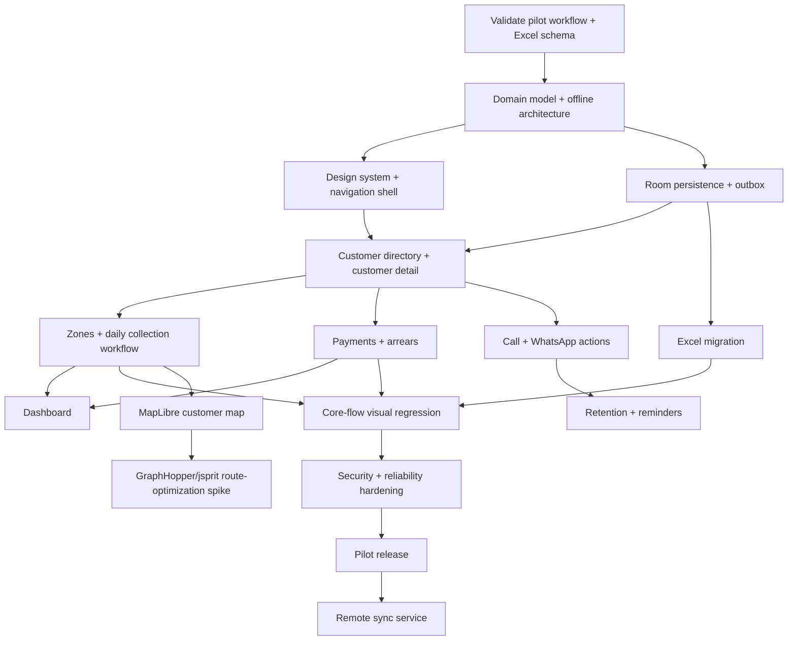

# CleanRoute delivery map

## Product objective

Replace the operator's Excel + phone workflow with an Android app that is simpler in the field, preserves offline operation and creates a path toward retention and route efficiency.

## MVP success condition

A non-technical operator can import existing customers, complete a full day of collections, register payments, identify arrears and export the data again without needing a reliable connection or developer assistance.

## Dependency graph

## Delivery policy

The critical path is **workflow correctness before optimization**.

Mapping, routing optimization, multi-device sync and loyalty must not block the first usable field build. They are designed early enough to avoid architectural dead ends, then introduced only after the core collection/payment loop is stable.

## Proof of Done baseline

Every implementation issue is done only when:
- acceptance criteria are demonstrably satisfied;
- unit tests cover domain rules where applicable;
- representative Compose previews exist for UI work;
- intentional visual changes are covered by Roborazzi goldens;
- offline/retry behavior is tested where applicable;
- no unrelated AppFactory-managed files are replaced;
- significant failures or near misses are recorded in `docs/engineering/lessons-learned.md`;
- the PR includes a RAIDER review.
